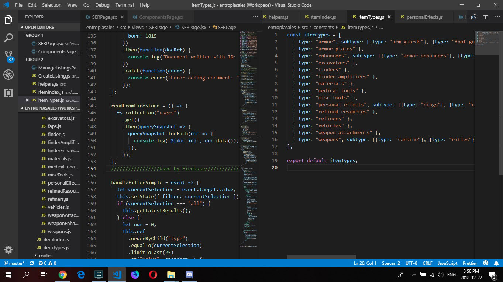

Why did I start a blog? After a few days frustrated with my firebase database, I realized a super painful truth. I need to either learn more about back-end development or use a different existing solution and time is short...

### Needed to cool off

Firebase's Real Time Database has worked absolute wonders. I have used it this entire year as a freelance full stack developer. But as I started with a real client base from a new website of mine that is gaining traction, entropiasales.com, the database is no longer enough to support what I need to do with search queries, filters, sorting, etc without building some other infrastructure. So, I started into Cloud Firestore because I loved Firebase so much. 

All this happened during the Christmas season of 2018, and honestly I feel conflicted onto whether I should do more work or spend time with family. You know, it's the holidays. And then, Eurika! I bought this domain, projectds.tech for 10 years and I haven't put it to use yet. Lets just take it easy, forget the databases for now and simply make a personal website and write stuff. Helps clear my head abit and put my attention to my family.

That's how this blog was born. Even though I planned to make it 3 months ago, it was the need for personal medidation that I come to start blogging. 

Welcome, I hope you enjoy this journey!

~David